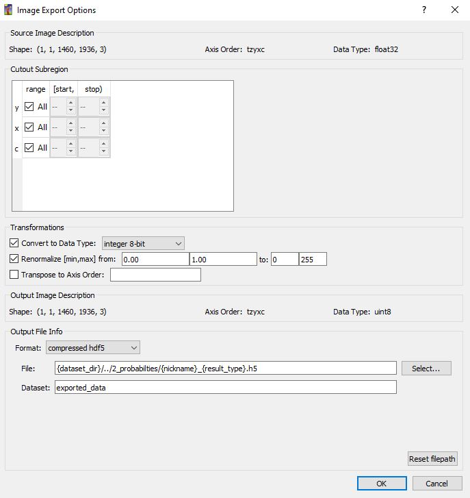
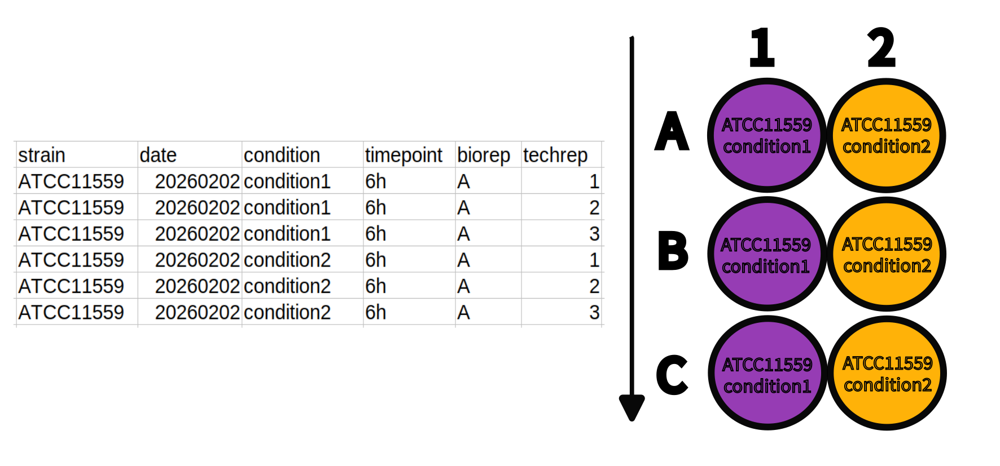
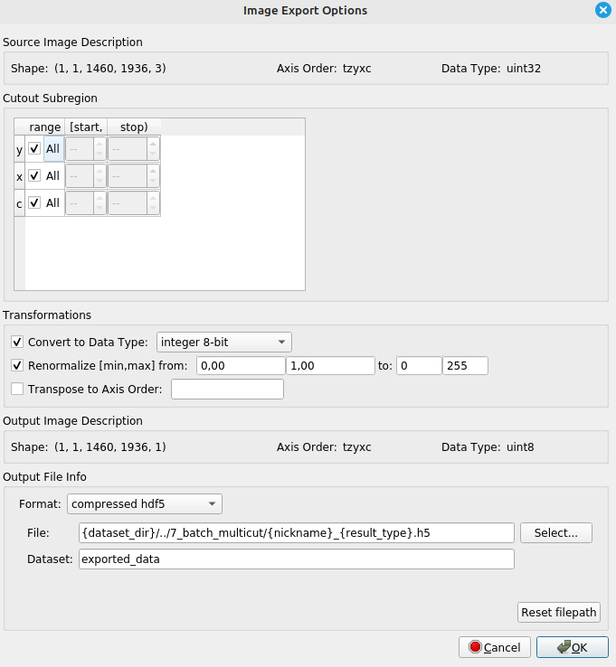
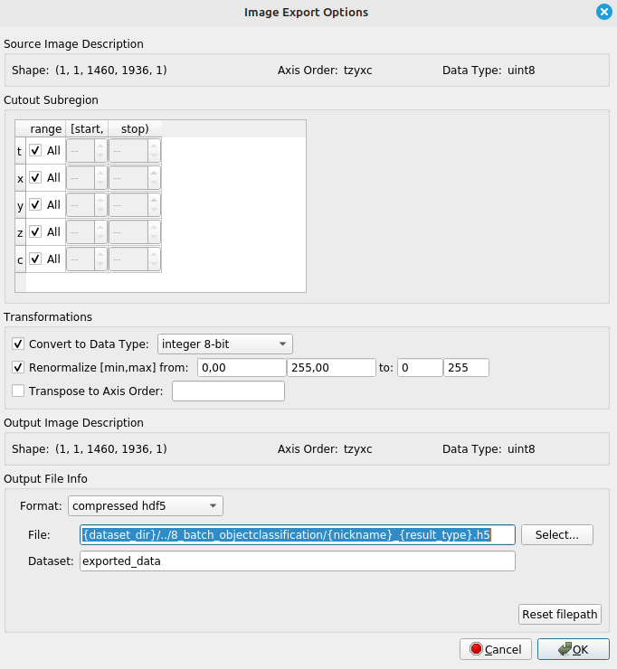
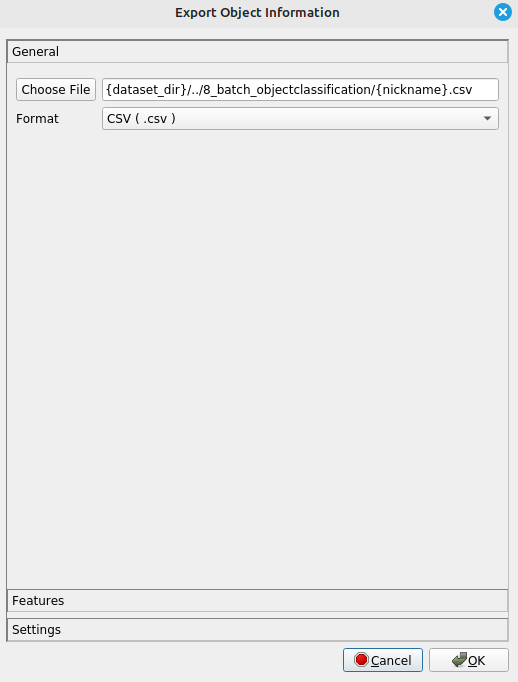
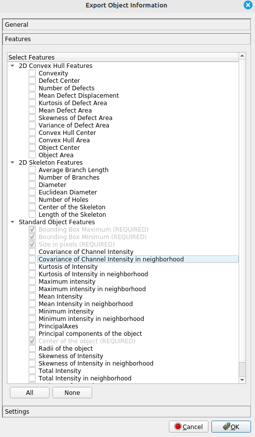

# caactus
caactus (**c**ell **a**nalysis **a**nd **c**ounting **t**ool **u**sing ilastik **s**oftware) is a collection of python scripts to provide a streamlined workflow for [ilastik-software](https://www.ilastik.org/), including data preparation, processing and analysis. It aims to provide biologist with an easy-to-use tool for counting and analyzing cells from a large number of microscopy pictures.

 .png)
 

# Introduction
The goal of this script collection is to provide an easy-to-use completion for the [Boundary-based segmentation with Multicut-workflow](https://www.ilastik.org/documentation/multicut/multicut) in [ilastik](https://www.ilastik.org/).
This workflow allows for the automatization of cell-counting from messy microscopic images with different (touching) cell types for biological research. 
For easy copy & paste, commands are provided in `grey code boxes` with one-click copy & paste.

# Installation
## Install miniconda, create an environment and install Python and vigra
- [Download and install miniconda](https://www.anaconda.com/docs/getting-started/miniconda/install#windows-installation) for your respective operating system according to the instructions.
  - Miniconda provides a lightweight package and environment manager. It allows you to create isolated environments so that Python versions and package dependencies required by caactus do not interfere with your system Python or other projects.
- Once installed, create an environment for using `caactus` with the following command from your cmd-line
  ```bash
  conda create -n caactus-env -c conda-forge "python>=3.10.12" vigra
  ```

## Install caactus
- Activate the `caactus-env` from the cmd-line with
  ```bash
  conda activate caactus-env
  ```
- To install `caactus` plus the needed dependencies inside your environment, use
  ```bash
  pip install caactus
  ```
- During the below described steps that call the `caactus-scripts`, make sure to have the `caactus-env` activated.


## Install ilastik
- [Download and install ilastik](https://www.ilastik.org/download) for your respective operating system.

# Quick Overview of the workflow
1. **Culture** organism of interest in 96-well plate
2. **Acquire** images of cells via microscopy.
3. **Create** project directory
4. **Rename** Files with the caactus-script ```renaming```
5. **Convert** files to HDF5 Format with the caactus-script  ```tif2h5py```
6. Train a [pixel classification](https://www.ilastik.org/documentation/pixelclassification/pixelclassification) model in ilastik for and later run it batch-mode.
7. Train a [boundary-based segmentation with Multicut](https://www.ilastik.org/documentation/multicut/multicut) model in ilastik for and later run it batch-mode.
8. **Remove** the background from the images using ```background_processing```
9. Train a [object classification](https://www.ilastik.org/documentation/objects/objects) model in ilastik for  and later run it batch-mode.
10. **Pool** all csv-tables  from the individual images into one global table with ```csv_summary```
- output generated: 
    - "df_clean.csv"
11. **Summarize** the data with  ```summary_statistics```
- output generated:
    - a) "df_summary_complete.csv" = .csv-table containing also "not usable" category,
    - b) "df_refined_complete.csv" = .csv-table without "not usable" category", 
    - c) "counts.csv" dataframe used in PlnModelling
    - d) bar graph ("barchart.png")
13. **Model** the count data with ```pln_modelling```
  - output generated:
    - a) "correlation_circle.png"
    - b) "pca_plot.png"

## Sample Dataset
- a sample dataset to quickly test the workflow can be accessed via  [zenodo](https://doi.org/10.5281/zenodo.17590576)
- to showcase the functionalties, the ilastik steps have been pretrained. Use caactus in batch-modes.


# Detailed Description of the Workflow
## 1. Culturing
- Culture your cells in a flat bottom plate of your choice and according to the needs of the organims being researched.
## 2. Image acquisition
- In your respective microscopy software environment, save the images of interest to `.tif-format`.
- From the image metadata, copy the pixel size. 

## 3. Data Preparation
### 3.1 Create Project Directory

- For portability of the ilastik projects create the directory in the following structure:\
(Please note: the below example already includes examples of resulting files in each sub-directory)
- This allows you to copy an already trained workflow and use it multiple times with new datasets.

```
project_directory  
├── 1_pixel_classification.ilp  
├── 2_boundary_segmentation.ilp  
├── 3_object_classification.ilp
├── renaming.csv
├── conif.toml
├── 0_1_original_tif_training_images
  ├── training-1.tif
  ├── training-2.tif
  ├── ...
├── 0_2_original_tif_batch_images
  ├── image-1.tif
  ├── image-2.tif
  ├── ..
├── 0_3_batch_tif_renamed
  ├── strain-xx_day-yymmdd_condition1-yy_timepoint-zz_parallel-1.tif
  ├── strain-xx_day-yymmdd_condition1-yy_timepoint-zz_parallel-2.tif
  ├── ..
├── 1_images
  ├── training-1.h5
  ├── training-2.h5
  ├── ...
├── 2_probabilities
  ├── strain-xx_day-yymmdd_condition1-yy_timepoint-zz_parallel-1-data_Probabilities.h5
  ├── strain-xx_day-yymmdd_condition1-yy_timepoint-zz_parallel-2-data_Probabilities.h5
  ├── ...
├── 3_multicut
  ├── strain-xx_day-yymmdd_condition1-yy_timepoint-zz_parallel-1-data_Multicut Segmentation.h5
  ├── strain-xx_day-yymmdd_condition1-yy_timepoint-zz_parallel-2-data_Multicut Segmentation.h5
  ├── ...
├── 4_objectclassification
  ├── strain-xx_day-yymmdd_condition1-yy_timepoint-zz_parallel-1-data_Object Predictions.h5
  ├── strain-xx_day-yymmdd_condition1-yy_timepoint-zz_parallel-1-data_table.csv
  ├── strain-xx_day-yymmdd_condition1-yy_timepoint-zz_parallel-2-data_Object Predictions.h5
  ├── strain-xx_day-yymmdd_condition1-yy_timepoint-zz_parallel-2-data_table.csv
  ├── ...
├── 5_batch_images
  ├── strain-xx_day-yymmdd_condition1-yy_timepoint-zz_parallel-1.h5
  ├── strain-xx_day-yymmdd_condition1-yy_timepoint-zz_parallel-2.h5
  ├── ...
├── 6_batch_probabilities
  ├── strain-xx_day-yymmdd_condition1-yy_timepoint-zz_parallel-1-data_Probabilities.h5
  ├── strain-xx_day-yymmdd_condition1-yy_timepoint-zz_parallel-2-data_Probabilities.h5
  ├── ...
├── 7_batch_multicut
  ├── strain-xx_day-yymmdd_condition1-yy_timepoint-zz_parallel-1-data_Multicut Segmentation.h5
  ├── strain-xx_day-yymmdd_condition1-yy_timepoint-zz_parallel-2-data_Multicut Segmentation.h5
  ├── ...
├── 8_batch_objectclassification
  ├── strain-xx_day-yymmdd_condition1-yy_timepoint-zz_parallel-1-data_Object Predictions.h5
  ├── strain-xx_day-yymmdd_condition1-yy_timepoint-zz_parallel-1-data_table.csv
  ├── strain-xx_day-yymmdd_condition1-yy_timepoint-zz_parallel-2-data_Object Predictions.h5
  ├── strain-xx_day-yymmdd_condition1-yy_timepoint-zz_parallel-2-data_table.csv
  ├── ...
├── 9_data_analysis

```

## 3.2 Getting started
- open the the caacuts Graphical User Interface (GUI) by opening the command line in Unix or Anaconda Powershell in Windows.
- make sure you have the caactus environmnet activated
- enter 
``` main.py ```/home/kuba/miniconda3/envs/caactus-env-314/bin/python /home/kuba/dev/caactus/caactus/gui/main.py
- On the top, enter the path to your mainfolder.
- For steps where it is relevant, choose between training and batch mode.
- The subdirectories have default naming according to 3.1. You can rename them.
- When all information have been entered, click ```Run```.
- Processing messages will appear on the bottom.
- The output can be accessed by inspecting the respective subdirectory from your main folder. 

## 4. Training
### 4.1. Selection of Training Images and Conversion
#### 4.1.1 Selection of Training data
- select a set of images that represant the different experimental conditions best
- store them in `0_1_original_tif_training_images`

#### 4.1.2 Conversion
1. Go to the `tif2h5py` tab. Select `Training` from the dropdown menu.
- The script in the background will convert `.tif-files` to `.h5-format`. 
- The `.h5-format` allows for better [performance when working with ilastik](https://www.ilastik.org/documentation/basics/performance_tips). 
2. When the file path are correct, click ```Run```.

### 4.2. Pixel Classification
1. When first training a pixel classification model in ilastik, open ilastik.

2. Create a new project and select "Pixel Classification" as the workflow.

3. Save it as 1_pixel_classification.ilp inside the main project directory.

4. Under Raw Data, add the .h5 files from 1_images folder.

5. Feature selection. Select the features you want to use for training. It is recommended to use all features.

6. For working with neighbouring / touching cells, it is suggested to create three classes: 
0 = interior, 
1 = background, 
2 = boundary 
(This follows python's 0-indexing logic where counting is started at 0).


7. Annotate the classes by drawing on the images.

8. Export the Predictions.
In prediction export change the settings to 
- `Convert to Data Type: integer 8-bit`
- `Renormalize from 0.00 1.00 to 0 255`
- File:
  ```bash
  {dataset_dir}/../2_probabilties/{nickname}_{result_type}.h5
  ```




- For more information, consult the [documentation for pixel classification with ilastik](https://www.ilastik.org/documentation/pixelclassification/pixelclassification). 


### 4.3 Boundary-based Segmentation with Multicut
1. When first training a boundary-based Segmentation model in ilastik, open ilastik.

2. Create a new project and select "Boundary-based Segmentation with Multicut" as the workflow.

3. Save it as `2_boundary_segmentation.ilp` inside the main project directory.

4. Under Raw Data, add the .h5 files from `1_images folder`.

5. Under Probabilities, add the data_Probabilities.h5 files from `2_probabilites` folder.

6. in DT Watershed,  use the input channel the corresponds to the order you used under project setup (in this case input channel = 2).


7. Annotate the edges by clicking on the edges between cells. Annotate the background by clicking on the background.

8. Export the Multicut Segmentation.
In prediction export change the settings to 
- `Convert to Data Type: integer 8-bit`
- `Renormalize from 0.00 1.00 to 0 255`
- Format: `compressed hdf5`
- File:
  ```bash
  {dataset_dir}/../3_multicut/{nickname}_{result_type}.h5
  ```


- For more information follow the [documentation for boundary-based segmentation with Multicut](https://www.ilastik.org/documentation/multicut/multicut).  


### 4.4 Background Processing
For futher processing in the object classification, the background needs to eliminated from the multicut data sets. For this the next script will set the numerical value of the largest region to 0. It will thus be shown as transpartent in the next step of the workflow. This operation will be performed in-situ on all `.*data_Multicut Segmentation.h5`-files in the `project_directory/3_multicut/`.
1. Select the `background-processing` tab in the GUI.
2. Select `Training` mode from the dropdown menu.
3. When the file path are correct, click ```Run```.


### 4.5. Object Classification
1. When first training a Object classification model in ilastik, open ilastik.

2. Create a new project and select "Object Classification [Inputs: Raw, Data, Pixel Prediction Map]" as the workflow.

3. Save it as 3_object_classification.ilp inside the main project directory.

4. Under "Raw Data", add the .h5 files from 1_images folder.

5. Under "Segmentation Image", add the data_Multicut Segmentation.h5 files from 3_multicut folder.

6. Define your cell types plus an additional category for "not-usable" objects, e.g. cell debris and cut-off objects on the side of the images.


7. Annotate the edges by clicking on the edges between cells.
 Annotate the background by clicking on the background.

8. Export the Object_Predictions.
In `Choose Export Imager Settings` change settings to
- `Convert to Data Type: integer 8-bit`
- `Renormalize from 0.00 1.00 to 0 255`
- Format: `compressed hdf5`
- File:
  ```bash
  {dataset_dir}/../4_objectclassification/{nickname}_{result_type}.h5
  ```


9. Export the Object data_table.csv-files
In `Configure Feature Table Export General` change seetings to
- format `.csv` and output directory File:
  ```bash
  {dataset_dir}/../4_objectclassification/{nickname}.csv`
  ```
- select your features of interest for exporting


For more information follow the [documentation for object classification](https://www.ilastik.org/documentation/objects/objects).


## 5. Batch Processing
- Once you have successfully trained all three ilastik models, you are ready to process large image datasets with the caactus pipeline.
1. store the images you want to process in the `0_2_original_tif_batch_images` directory
2. Perform steps 4.1 to 4.5 in batch mode, as explained in detail below (5.1 to 5.5).
3. When relevant select batch in the dropdown menu in the caactus GUI.
- For more information, follow the [documentation for batch processing](https://www.ilastik.org/documentation/basics/batch)
  
### 5.1 Rename Files
- Rename the `.tif-files` so that they contain information about your cells and experimental conditions
1. Create a csv-file that contains the information you need in columns. Each row corresponds to one image. Follow the same order as your images files are stored in the respective directory.

- The script will rename your files in the following format ```columnA-value1_columnB-value2_columnC_etc.tif ``` eg. as seen in the example below picture 1 (well A1 from our plate) will be named ```strain-ATCC11559_date-20241707_timepoint-6h_biorep-A_techrep-1.tif ```

2. Select the Renaming tab in the caactus GUI. When the file path are correct, click ```Run```.


CAVE: Do not use underscores or dashes in the column names or values, as they will be used as delimiters in the new file names.

CAVE: The only hardcoded column names needed are "biorep", and "techrep". They are needed in downstream analysis for calculating averages.
"""

#### 5.2 Conversion
1. Go to the `tif2h5py` tab. Select `Batch` from the dropdown menu.
- The script in the background will convert `.tif-files` to `.h5-format`. 
- The `.h5-format` allows for better [performance when working with ilastik](https://www.ilastik.org/documentation/basics/performance_tips). 
2. When the file path are correct, click ```Run```.

### 5.3 Batch Processing Pixel Classification

1. Open ilastik.

2. Open your trained ilastik pixel classification project (e.g. `1_pixel_classification.ilp`).

3. Go to `5. Batch processing` tab

4. Under `1.Input Data`,`Raw data`, add the .h5 files from `5_batch_images` folder.                                                                  

5. Under `4. Prediction Export`, select `Export predictions` and choose a folder for the output (e.g. change the export directory to `File`:
  ```bash
  {dataset_dir}/../6_batch_probabilities/{nickname}_{result_type}.h5
  ```


                                                                                    
6. Go to `5. Batch Processing` and click `Process all files`.

7. The output will be saved as _Probabilities.h5 files in the output folder.

### 5.4 Batch Processing Multicut Segmentation

1. Open ilastik.

2. Open your trained ilastik boundary-Segmentation project (e.g. open the `2_boundary_segmentation.ilp` project file).

3. Go to `5. Batch processing`.

4. Under `1.Input Data`,`Raw data`, add the .h5 files from `5_batch_images` folder.
                                                                                                                                                                          
5. Under `1.Input Data`,`Probabilities`, add the data_Probabilities.h5 files from `6_batch_probabilities` folder.

6. Under `4. Data Export`, select `Choose Export Image Settings` and choose a folder for the output (e.g. 7_batch_multicut).




7. Go to `5. Batch Processing` and click `Process all files`.

8. The output will be saved as _Multicut Segmentation.h5 files in the output folder.

- under `Choose Export Image Settings` change the export directory to `File`:
  ```bash
  {dataset_dir}/../7_batch_multicut/{nickname}_{result_type}.h5
  ```


### 5.5 Background Processing 
For futher processing in the object classification, the background needs to eliminated from the multicut data sets. For this the next script will set the numerical value of the largest region to 0. It will thus be shown as transpartent in the next step of the workflow. This operation will be performed in-situ on all `.*data_Multicut Segmentation.h5`-files in the `project_directory/3_multicut/`.
1. Select the `background-processing` tab in the GUI.
2. Select `Batch` mode from the dropdown menu.
3. When the file path are correct, click ```Run```.


### 5.6 Batch processing Object classification 

1. Open ilastik.

2. Open your trained ilastik object classification project (`3_object_classification.ilp`).

3. Go to `5. Batch processing` tab.

4. Under `1.Input Data`, `Raw data`, add the .h5 files from `5_batch_images` folder.
                                                                                                                                                                          
5. Under `1.Input Data`,`Segmentation Image`, add the data_Multicut Segmentation.h5 files from `7_batch_multicut` folder.

6. Under `4. Object Information Export`, choose  `Export Image Settings` change the export directory to `File`:
  ```bash
  {dataset_dir}/../8_batch_objectclassification/{nickname}_{result_type}.h5
  ```



7. Under "4. Object Information Export", choose "Configure Feature Table Export" with the following settings:

                                                                        
8. In `Configure Feature Table Export General` choose format `.csv` and change output directory to:
  ```bash
  {dataset_dir}/../8_batch_objectclassification/{nickname}.csv
  ```


Choose  `Features` to choose the Feature you are interested in exporting

9. Go to `5. Batch Processing` and click `Process all files`.
                                                                                      
10. The output will be saved as data_Object Predictions.h5 files and data_table.csv in the output folder.


## 6. Post-Processing and Data Analysis
- Please be aware, the last two scripts, `summary_statisitcs.py` and `pln_modelling.py` at this stage are written for the analysis and visualization of two independent variables.
### 6.1 Merging Data Tables and Table Export
The next script will combine all tables from all images into one global table for further analysis. Additionally, the information stored in the file name will be added as columns to the dataset. 
- Technically from this point on, you can continue to use whatever software / workflow your that is easiest for use for subsequent data analysis. 
1. Go to the `CSV summary` tab in the caactus GUI.
2. Enter the pixel size for cell size calculation.
3. When the file path are correct, click ```Run```.
4. The output generated will be `df_clean.csv`.
5. This spreadsheet now has all feature tables that are the output of 5.6 Object classification united in one spreadsheet.
5. You can use this spreadsheet now, to continue with analysis in the software of your choice.


### 6.2 Creating Summary Statistics

- This script processes EUCAST data and generates summary statistics and a stacked bar plot of predicted classes cell categories.
- If working with EUCAST antifungal susceptibility testing, use the `Summary Statistics EUCAST` tab
- For the stacked bar plot, it groups data by the two variables that you enter.
- It computes the average count and percentage of each predicted class, across replicates (technical and biological), for each combination of the two grouping variables.
- It visualizes the distribution in stacked bar plots of classes across different conditions.
- The first variable you enter will be displayed on the x-axis (e.g. incubation temperature), and the second variable will be used for faceting (e.g. timepoint).
- This will create separate subplots for each level of that variable.
- The plot will show the percentage distribution of predicted classes for each condition, allowing you to compare how the classes are distributed across different experimental conditions defined by the two grouping variables.
- The colors of the bars will correspond to the predicted classes, as defined in your color mapping.
- By default the IBM coloor-blind friendly palette is used, but you can customize the colors by providing the HEX color code.
1. Go to the `Summary Statistics` tab in the caactus GUI.
2. When the file path are correct, click ```Run```.
3. The output generated will be 
    - a) "df_summary_complete.csv" = .csv-table containing also "not usable" category,
    - b) "df_refined_complete.csv" = .csv-table without "not usable" category", 
    - c) "counts.csv" dataframe used in PlnModelling
    - d) bar graph ("barchart.png")

### 6.3 PLN Modelling 
- This script runs ZIPln modelling on input data with dynamic design and generates PCA visualizations and a correlation circle plot.

- The two grouping variables you enter will be used in the model formula and for visualizing the PCA results.

- The will be combined into a single factor for the model, and the PCA plot will show the latent variable projections colored by this combined category.

- The correlation circle plot will show how the original variables relate to the latent dimensions, helping you interpret the PCA results in terms of the original grouping variables.

- CAVE: the limit of categories for display in the PCA-plot is n=15

1. Go to the `Summary Statistics` tab in the caactus GUI.
2. When the file path are correct, click ```Run```.
3. The output generated will be 
    - a) "correlation_circle.png"
    - b) "pca_plot.png"


