# caactus
caactus (**c**ell **a**nalysis **a**nd **c**ounting **t**ool **u**sing ilastik **s**oftware) is a collection of python scripts to provide a streamlined workflow for [ilastik-software](https://www.ilastik.org/), including data preparation, processing and analysis. It aims to provide biologist with an easy-to-use tool for counting and analyzing cells from a large number of microscopy pictures.

 .png)
 

# Introduction
The goal of this script collection is to provide an easy-to-use completion for the [Boundary-based segmentation with Multicut-workflow](https://www.ilastik.org/documentation/multicut/multicut) in [ilastik](https://www.ilastik.org/).
This workflow allows for the automatization of cell-counting from messy microscopic images with different (touching) cell types for biological research. 
For easy copy & paste, commands are provided in `grey code boxes` with one-click copy & paste.

# Installation
## Install miniconda, create an environment and install Python and vigra
- [Download and install miniconda](https://www.anaconda.com/docs/getting-started/miniconda/install#windows-installation) for your respective operating system according to the instructions.
  - Miniconda provides a lightweight package and environment manager. It allows you to create isolated environments so that Python versions and package dependencies required by caactus do not interfere with your system Python or other projects.
- Once installed, create an environment for using `caactus` with the following command from your cmd-line
  ```bash
  conda create -n caactus-env -c pytorch -c conda-forge python=3.12 pytorch vigra h5py
  ```

## Install caactus
- Activate the `caactus-env` from the cmd-line with
  ```bash
  conda activate caactus-env
  ```
- To install `caactus` plus the needed dependencies inside your environment, use
  ```bash
  pip install caactus
  ```
- During the below described steps that call the `caactus-scripts`, make sure to have the `caactus-env` activated.


## Install ilastik
- [Download and install ilastik](https://www.ilastik.org/download) for your respective operating system.
> [!NOTE]
> We developed the pipeline on ilastik 1.4.0. For optimal user experience, we recommend installing ilastik 1.4.0. Scroll down to "Previous stable versions" on the ilastik download webpage.

# Quick Overview of the workflow
1. **Culture** organism of interest in 96-well plate
2. **Acquire** images of cells via microscopy.
3. **Create** project directory
4. **Rename** Files with the caactus-script ```renaming```
5. **Convert** files to HDF5 Format with the caactus-script  ```tif2h5py```
6. Train a [pixel classification](https://www.ilastik.org/documentation/pixelclassification/pixelclassification) model in ilastik for and later run it batch-mode.
7. Train a [boundary-based segmentation with Multicut](https://www.ilastik.org/documentation/multicut/multicut) model in ilastik for and later run it batch-mode.
8. **Remove** the background from the images using ```background_processing```
9. Train a [object classification](https://www.ilastik.org/documentation/objects/objects) model in ilastik for  and later run it batch-mode.
10. **Pool** all csv-tables  from the individual images into one global table with ```csv_summary```
- output generated: 
    - `df_clean.csv`
11. **Summarize** the data with  ```summary_statistics```
- output generated:
    - a) `df_summary_complete.csv` = .csv-table containing also **not usable** category,
    - b) `df_refined_complete.csv` = .csv-table without **not usable** category", 
    - c) `counts.csv` dataframe used in PlnModelling
    - d) stacked bar graph (`barchart.png`)
12. **Model** the count data with ```pln_modelling```
  - output generated:
    - a) `correlation_circle.png`
    - b) `pca_plot.png`

## Sample Dataset
- a sample dataset to quickly test the workflow can be accessed via  [zenodo](https://doi.org/10.5281/zenodo.18799803)
- to showcase the functionalties, the ilastik steps have been pretrained. Use caactus in batch-modes.
- **go to 7.1-7.11 for a detailed tutorial**


# Detailed Description of the Workflow
## 1. Culturing
- Culture your cells in a flat bottom plate of your choice and according to the needs of the organims being researched.
## 2. Image acquisition
- In your respective microscopy software environment, export the images of interest to `.tif-format`.
- From the image metadata, copy the pixel size. 

## 3. Data Preparation
### 3.1 Create Project Directory

- For portability of the ilastik projects create the directory in the following structure:\
> [!NOTE]
> The directory structure below already includes examples of resulting files in each sub-directory.
- This allows you to copy an already trained workflow and use it multiple times with new datasets, when relative paths are enabled.

```
project_directory = Main folder  
├── 1_pixel_classification.ilp  
├── 2_boundary_segmentation.ilp  
├── 3_object_classification.ilp
├── renaming.csv
├── conif.toml
├── 0_1_original_tif_training_images
  ├── training-1.tif
  ├── training-2.tif
  ├── ...
├── 0_2_original_tif_batch_images
  ├── image-1.tif
  ├── image-2.tif
  ├── ..
├── 0_3_batch_tif_renamed
  ├── strain-xx_day-yymmdd_condition1-yy_timepoint-zz_parallel-1.tif
  ├── strain-xx_day-yymmdd_condition1-yy_timepoint-zz_parallel-2.tif
  ├── ..
├── 1_images
  ├── training-1.h5
  ├── training-2.h5
  ├── ...
├── 2_probabilities
  ├── strain-xx_day-yymmdd_condition1-yy_timepoint-zz_parallel-1-data_Probabilities.h5
  ├── strain-xx_day-yymmdd_condition1-yy_timepoint-zz_parallel-2-data_Probabilities.h5
  ├── ...
├── 3_multicut
  ├── strain-xx_day-yymmdd_condition1-yy_timepoint-zz_parallel-1-data_Multicut Segmentation.h5
  ├── strain-xx_day-yymmdd_condition1-yy_timepoint-zz_parallel-2-data_Multicut Segmentation.h5
  ├── ...
├── 4_objectclassification
  ├── strain-xx_day-yymmdd_condition1-yy_timepoint-zz_parallel-1-data_Object Predictions.h5
  ├── strain-xx_day-yymmdd_condition1-yy_timepoint-zz_parallel-1-data_table.csv
  ├── strain-xx_day-yymmdd_condition1-yy_timepoint-zz_parallel-2-data_Object Predictions.h5
  ├── strain-xx_day-yymmdd_condition1-yy_timepoint-zz_parallel-2-data_table.csv
  ├── ...
├── 5_batch_images
  ├── strain-xx_day-yymmdd_condition1-yy_timepoint-zz_parallel-1.h5
  ├── strain-xx_day-yymmdd_condition1-yy_timepoint-zz_parallel-2.h5
  ├── ...
├── 6_batch_probabilities
  ├── strain-xx_day-yymmdd_condition1-yy_timepoint-zz_parallel-1-data_Probabilities.h5
  ├── strain-xx_day-yymmdd_condition1-yy_timepoint-zz_parallel-2-data_Probabilities.h5
  ├── ...
├── 7_batch_multicut
  ├── strain-xx_day-yymmdd_condition1-yy_timepoint-zz_parallel-1-data_Multicut Segmentation.h5
  ├── strain-xx_day-yymmdd_condition1-yy_timepoint-zz_parallel-2-data_Multicut Segmentation.h5
  ├── ...
├── 8_batch_objectclassification
  ├── strain-xx_day-yymmdd_condition1-yy_timepoint-zz_parallel-1-data_Object Predictions.h5
  ├── strain-xx_day-yymmdd_condition1-yy_timepoint-zz_parallel-1-data_table.csv
  ├── strain-xx_day-yymmdd_condition1-yy_timepoint-zz_parallel-2-data_Object Predictions.h5
  ├── strain-xx_day-yymmdd_condition1-yy_timepoint-zz_parallel-2-data_table.csv
  ├── ...
├── 9_data_analysis

```

## 3.2 Getting started
- Open the caactus Graphical User Interface (GUI) by opening the command line in Unix or Anaconda Powershell/Prompt in Windows.
- Make sure you have the caactus environment activated:
```bash
conda activate caactus-env
```
- Type `caactus` and hit `Enter` to start the GUI:
```bash
caactus
```
- At the top, enter the path to your **Main Folder** (use the Browse button or type/ copy&paste the full path).
- Set shared analysis parameters once in **Global Settings**: Pixel Size, Variable Names, Class Order, Color Mapping. EUCAST-specific settings can be expanded below.
- The workflow is shown as a numbered list of steps. When in training or batch modes, select the respective mode from the dropdown **Global Settings**.
- Click **Run** to execute a step. 
- Each step includes description in **? Help** pop-up. For ilastik steps, detailed step-by-step instructions are included.
- Processing messages appear in the log panel at the bottom.
- The output can be accessed in the respective subdirectory of your main folder.

## 4. Training

To facilitate cross-platform reusability of the ilastik models, make sure to store Raw Data, Probabilities and Prediction Maps in **Relative Links**. This allows for portability of the models to other storage locations.

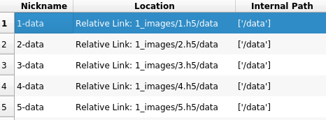

In case absolute file path is selected, right click on the location and select `edit properties` under `storage` the path logic can be modified

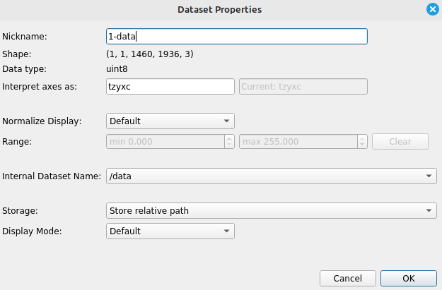


### 4.1. Selection of Training Images and Conversion
#### 4.1.1 Selection of Training data
- select a set of images that represant the different experimental conditions best
- store them in `0_1_original_tif_training_images`

#### 4.1.2 Conversion
1. In the caactus GUI, select `training` from the dropdown menu in **Global Settings**
2. Find **2. Tif to H5**. 
- The script converts `.tif` files to `.h5` format for better [performance in ilastik](https://www.ilastik.org/documentation/basics/performance_tips).
2. Click **Run**.

### 4.2. Pixel Classification
1. When first training a pixel classification model in ilastik, open ilastik.

2. Create a new project and select **Pixel Classification** as the workflow.

3. Save it as `1_pixel_classification.ilp` inside the main project directory.

4. Under Raw Data, add the `*.h5` files from `1_images` folder.

5. Feature selection. Select the features you want to use for training. It is recommended to use all features.

6. For working with neighbouring / touching cells, it is suggested to create three classes: 
0 = interior, 
1 = background, 
2 = boundary 
(This follows python's 0-indexing logic where counting is started at 0).

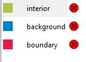


7. Annotate the classes by drawing on the images.

8. Export the Predictions.
In prediction export change the settings to 
- `Convert to Data Type: integer 8-bit`
- `Renormalize from 0.00 1.00 to 0 255`
- File:
  ```bash
  {dataset_dir}/../2_probabilties/{nickname}_{result_type}.h5
  ```


9. Click `OK`.

10. Click `Export All`.

11. The output will be saved as `*_Probabilities.h5` files in the `2_probabilities` folder.


- For more information, consult the [documentation for pixel classification with ilastik](https://www.ilastik.org/documentation/pixelclassification/pixelclassification). 


### 4.3 Boundary-based Segmentation with Multicut
1. When first training a boundary-based Segmentation model in ilastik, open ilastik.

2. Create a new project and select **Boundary-based Segmentation with Multicut** as the workflow.

3. Save it as `2_boundary_segmentation.ilp` inside the main project directory.

4. Under Raw Data, add the .h5 files from `1_images folder`.

5. Under Probabilities, add the data_Probabilities.h5 files from `2_probabilites` folder.

6. in DT Watershed,  use the input channel the corresponds to the order you used under project setup (in this case input channel = 2).

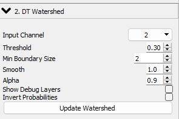


7. Annotate the edges by clicking on the edges between cells. Annotate the background by clicking on the background.

8. Export the Multicut Segmentation.
In prediction export change the settings to 
- `Convert to Data Type: integer 8-bit`
- `Renormalize from 0.00 1.00 to 0 255`
- Format: `compressed hdf5`
- File:
  ```bash
  {dataset_dir}/../3_multicut/{nickname}_{result_type}.h5
  ```


9. Click `OK`.

10. Click `Export All`.

11. The output will be saved as `*_Multicut Segmentation.h5` files in the `3_multicut` folder.

- For more information follow the [documentation for boundary-based segmentation with Multicut](https://www.ilastik.org/documentation/multicut/multicut).  


### 4.4 Background Processing
For further processing in object classification, the background must be removed from the multicut data sets. This script sets the numerical value of the largest region to 0, making it transparent in the next step. The operation runs in-place on all `*_Multicut Segmentation.h5` files in `3_multicut/`.
1. In the caactus GUI, find **5. Background Processing**.
2. Make sure `training`is still selected in **Mode** under **Global Settings**.
2. Click **Run**.


### 4.5. Object Classification
1. When first training a Object classification model in ilastik, open ilastik.

2. Create a new project and select **Object Classification [Inputs: Raw, Data, Pixel Prediction Map]** as the workflow.

3. Save it as `3_object_classification.ilp` inside the main project directory.

4. Under **Raw Data**, add the `.h5` files from `1_images folder`.

5. Under **Segmentation Image**, add the `*_Multicut Segmentation.h5` files from `3_multicut` folder.

6. Define your cell types plus an additional category for **not usable** objects, e.g. cell debris and cut-off objects on the side of the images.
> [!NOTE]
> Default class names in caactus are `resting`, `swollen`, `germling`, `hyphae`, `notusable` (and `mycelium` for the EUCAST workflow). You are welcome to change them — just make sure to also update the names in the caactus GUI when performing the analysis steps below.


7. Annotate the edges by clicking on the edges between cells.
 Annotate the background by clicking on the background.

8. Export the Object_Predictions.
In `Choose Export Imager Settings` change settings to
- `Convert to Data Type: integer 8-bit`
- `Renormalize from 0.00 1.00 to 0 255`
- Format: `compressed hdf5`
- File:
  ```bash
  {dataset_dir}/../4_objectclassification/{nickname}_{result_type}.h5
  ```

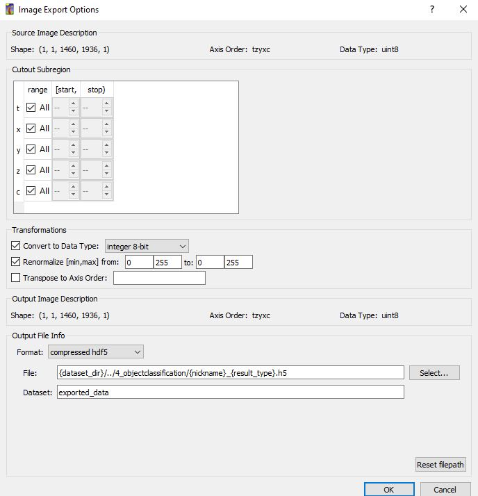


9. Export the Object data_table.csv-files
In `Configure Feature Table Export General` change seetings to
- format `.csv` and output directory File:
  ```bash
  {dataset_dir}/../4_objectclassification/{nickname}.csv
  ```
- select your features of interest for exporting
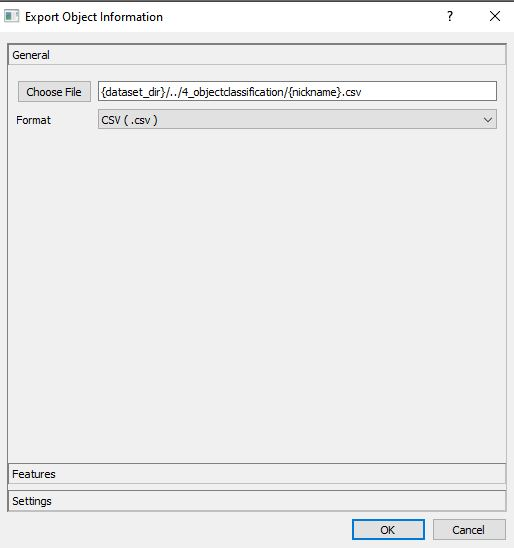

10. Click `OK`.

11. Click `Export All`.

12. The output will be saved as `*_Object Predictions.h5` files and `*_table.csv` in the `4_objectclassification` folder.


- For more information follow the [documentation for object classification](https://www.ilastik.org/documentation/objects/objects).


## 5. Batch Processing
- Once you have successfully trained all three ilastik models, you are ready to process large image datasets with the caactus pipeline.
1. store the images you want to process in the `0_2_original_tif_batch_images` directory
2. Perform steps 4.1 to 4.5 in batch mode, as explained in detail below (5.1 to 5.5).
3. Select **Mode** `batch` in the dropdown menu in **Global settings** in the caactus GUI.
- For more information, follow the [documentation for batch processing](https://www.ilastik.org/documentation/basics/batch)
  
### 5.1 Rename Files
- Rename the `.tif-files` so that they contain information about your cells and experimental conditions
1. Create a csv-file that contains the information you need in columns. Each row corresponds to one image. Follow the same order as your images files are stored in the respective directory (alphabetically).

- The script will rename your files in the following format ```columnA-value1_columnB-value2_columnC_etc.tif ``` eg. as seen in the example below picture 1 (well A1 from our plate) will be named

 ```strain-ATCC11559_date-20241707_timepoint-6h_biorep-A_techrep-1.tif ```

> [!CAUTION]
> Do not use underscores (`_`) or dashes (`-`) in column names or values — these characters are used as delimiters in the new file names.

> [!IMPORTANT]
> The only hardcoded column names required are **biorep** and **techrep**. They are needed in downstream analysis for calculating averages.


2. In the caactus GUI under **Pre-Processing**, find **1. Renaming** and click **Run**.


> [!TIP]
> After renaming, we recommend deleting the contents of `0_2_original_tif_batch_images` to save disk space.

#### 5.2 Conversion
1. In the caactus GUI, find **2. Tif to H5**. Select `batch` from the dropdown menu.
- The script converts `.tif` files to `.h5` format for better [performance in ilastik](https://www.ilastik.org/documentation/basics/performance_tips).
2. Click **Run**.

> [!TIP]
> After converting, we recommend deleting the contents of `0_3_batch_renamed` to save disk space.

### 5.3 Batch Processing Pixel Classification

In the caactus GUI, find **3. Pixel Classification**, click **? Help** for the full ilastik instructions. Summary:

1. Open ilastik.

2. Open your trained pixel classification project (e.g. `1_pixel_classification.ilp`).

> [!CAUTION]
> DO NOT CHANGE anything in `1. Input Data`, `2. Feature Selection`, or `3. Training` when running Batch Processing!

3. Under `4. Prediction Export`:
   - From the dropdown select **Probabilities** (not Simple Segmentation, Uncertainty, Features, or Labels).
   - Click **Choose Export Image Settings** and set the output file path at `File`:
  ```bash
  {dataset_dir}/../6_batch_probabilities/{nickname}_{result_type}.h5
  ```

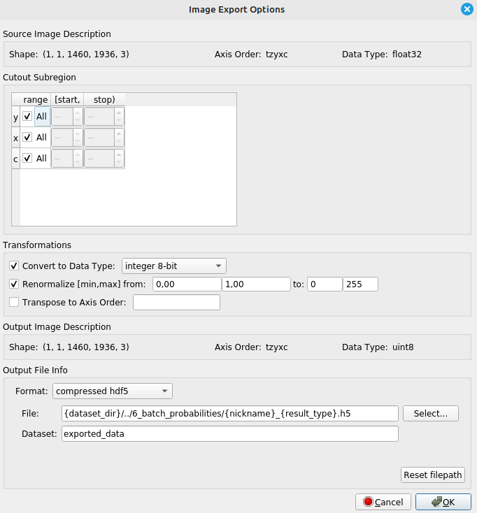

4. Click `OK`

5. Go to `5. Batch processing` tab

6. Under `Raw data`, add the .h5 files from `5_batch_images` folder.                                                                  
                                                                                    
7. Now click `Process all files`.

8. The output will be saved as `*_Probabilities.h5` files in the output folder (`6_batch_probabilities`).

### 5.4 Batch Processing Multicut Segmentation

In the caactus GUI, find **4. Boundary Segmentation**, click **? Help** for the full ilastik instructions. Summary:

1. Open ilastik.

2. Open your trained Boundary Segmentation project (e.g. `2_boundary_segmentation.ilp`).
> [!CAUTION]
> DO NOT CHANGE anything in `1. Input Data`, `2. DT Watershed`, or `3. Training and Multicut` when running Batch Processing!

> [!NOTE]
> The `*_Multicut Segmentation.h5` output files are generated by ilastik in this step — they do not exist beforehand.

3. Under `4. Data Export`, click **Choose Export Image Settings** and set the output path at `File`:
  ```bash
  {dataset_dir}/../7_batch_multicut/{nickname}_{result_type}.h5
  ```
4. Click `OK`

5. Go to `5. Batch processing`.

6. Under,`Raw data`, add the .h5 files from `5_batch_images` folder.                                                                                                 
7. Under `Probabilities`, add the data_Probabilities.h5 files from `6_batch_probabilities` folder.


8. Go to `5. Batch Processing` and click `Process all files`.

9. The output will be saved as `*_Multicut Segmentation.h5` files in the output folder (`7_batch_multicut`).


### 5.5 Background Processing
1. In the caactus GUI, find **5. Background Processing**, click **? Help** for the description. 
2. Click **Run**. This removes the background from all `*_Multicut Segmentation.h5` files in `7_batch_multicut/` by setting the largest region value to 0 (transparent in ilastik).


### 5.6 Batch processing Object classification

In the caactus GUI, find **6. Object Classification**, click **? Help** for the full ilastik instructions. Summary:

1. Open ilastik.

2. Open your trained object classification project (`3_object_classification.ilp`).
> [!CAUTION]
> DO NOT CHANGE anything in `1. Input Data`, `2. Object Feature Selection`, or `3. Object Classification` when running Batch Processing!

3. Under `4. Object Information Export`:
   - From the dropdown select **Object Predictions** (default).
   - Click **Choose Export Image Settings** and set the output path at `File`:
  ```bash
  {dataset_dir}/../8_batch_objectclassification/{nickname}_{result_type}.h5
  ```


4. Under "4. Object Information Export", choose "Configure Feature Table Export" with the following settings:

                                                                        
5. In `Configure Feature Table Export General` choose format `.csv` and change output directory to:
  ```bash
  {dataset_dir}/../8_batch_objectclassification/{nickname}.csv
  ```

Choose  `Features` to choose the Feature you are interested in exporting


6. Click `OK`

7. Go to 5. `Batch Processing` tab

8. Under  `Raw data`, add the .h5 files from `5_batch_images` folder.

9. Under `Segmentation Image`, add the data_Multicut Segmentation.h5 files from `7_batch_multicut` folder.

10. Go to `5. Batch Processing` and click `Process all files`.

11. The output will be saved as `*_Object Predictions.h5` files and `*_table.csv` in the output folder (`8_batch_objectclassification`).


## 6. Post-Processing and Data Analysis

- Please be aware, the last two scripts, `summary_statisitcs.py` and `pln_modelling.py` at this stage are written for the analysis and visualization of two independent variables. The take the result of the batch-processing steps as input.

1. In the caactus GUI, set **Variable Names**, **Class Order**, **Color Mapping** and **Pixel Size (µm)** in **Global Settings**.

### 6.1 Merging Data Tables and Table Export

The next script will combine all tables from all images into one global table for further analysis. Additionally, the information stored in the file name will be added as columns to the dataset. 
- Technically from this point on, you can continue to use whatever software / workflow your that is easiest for use for subsequent data analysis. 
1. Find **7. CSV Summary** and click **Run**.
2. The output generated will be `df_clean.csv` in `9_data_analysis`
3. This spreadsheet now has all feature tables that are the output of **5.6 Object classification** united in one spreadsheet.
4. You can use this spreadsheet now, to continue with analysis in the software of your choice.


### 6.2 Creating Summary Statistics

- This script processes EUCAST data and generates summary statistics and a stacked bar plot of predicted classes cell categories.
- If working with EUCAST antifungal susceptibility testing, use the `9. EUCAST Summary Statistics `
- For the stacked bar plot, it groups data by the two variables that you enter.
- It computes the average count and percentage of each predicted class, across replicates (technical and biological), for each combination of the two grouping variables.
- It visualizes the distribution in stacked bar plots of classes across different conditions.
- The first variable you enter will be displayed on the x-axis (e.g. incubation temperature), and the second variable will be used for faceting (e.g. timepoint).
- This will create separate subplots for each level of that variable.
- The plot will show the percentage distribution of predicted classes for each condition, allowing you to compare how the classes are distributed across different experimental conditions defined by the two grouping variables.
- The colors of the bars will correspond to the predicted classes, as defined in your color mapping.
- By default the IBM coloor-blind friendly palette is used, but you can customize the colors by providing the HEX color code.

1. Find **8. Summary Statistics** and click **Run**.
2. Output:
    - a) `df_summary_complete.csv` — full table including "not usable" category
    - b) `df_refined_complete.csv` — table without "not usable" category
    - c) `counts.csv` — count data used for PLN modelling
    - d) `barchart.png` — stacked bar chart

### 6.3 PLN Modelling 

- This script runs ZIPln modelling on input data with dynamic design and generates PCA visualizations and a correlation circle plot.

- The two grouping variables you enter will be used in the model formula and for visualizing the PCA results.

- The will be combined into a single factor for the model, and the PCA plot will show the latent variable projections colored by this combined category.

- The correlation circle plot will show how the original variables relate to the latent dimensions, helping you interpret the PCA results in terms of the original grouping variables.

> [!WARNING]
> The limit of categories displayed in the PCA plot is n=15.

1. In the caactus GUI, make sure **Variable Names** and **Class Order** are set correctly in Global Settings.
2. Find **step 10 – PLN Modelling** and click **Run**.
3. Output:
    - a) `correlation_circle.png`
    - b) `pca_plot.png`
> [!NOTE]
> **Variable Names** and **Class Order** are shared with Summary Statistics — set them once in Global Settings.


## 7. Tutorial
### 7.1 Download Sample Data
1. Go to [zenodo](https://doi.org/10.5281/zenodo.18799803) to download the sample data.
2. Unpack the `.zip`-file into your project folder.
3. The path to where you unpacked the sample data will be your main folder (e.g. `/home/usr/Documents/sampledata_CD6_zenodo`).
4. To showcase the functionalties, the ilastik steps have been pretrained. Use caactus in batch-mode for the following steps. From the dropdown menu in **Global settings** in the GUI, select `batch`

> [!NOTE]
> Some subdirectories are intentionally left empty. The tutorial is designed to teach batch mode with pretrained models. `0_1_original_tif_training_images` stays empty; the other empty subdirectories will be filled as you follow the steps below.


5. make sure you have caactus installed (see Installation above)
- make sure you have the caactus environmnet activated 
```bash
conda activate caactus-env
```
- now simply type `caactus` and hit `enter`to start the graphical user interace
```bash
caactus
```
6. We recommend working with two screens. This allows to follow the instructions implemented in the caactus GUI while performing the steps in ilastik and quickly switiching back to the caactus steps for fast completion of the pipeline. 

### 7.2 Global Settings

1. On the top, enter the path to your mainfolder.

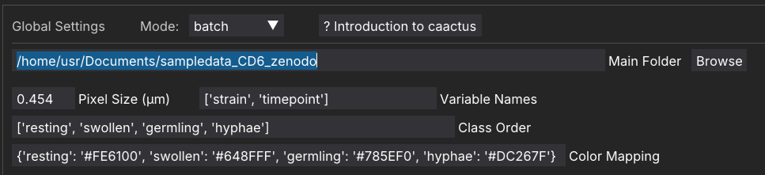


2. Change the default values `['strain', 'timepoint']` to 

```bash
['condition1','condition2']
```

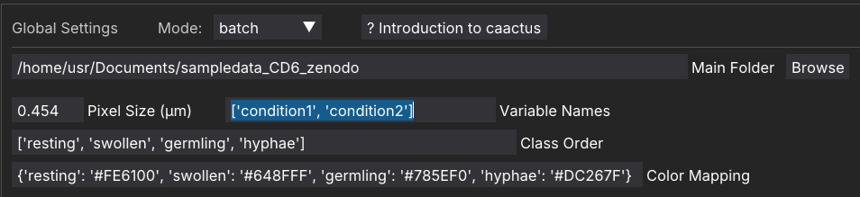

3. Set `Mode` to `batch`.

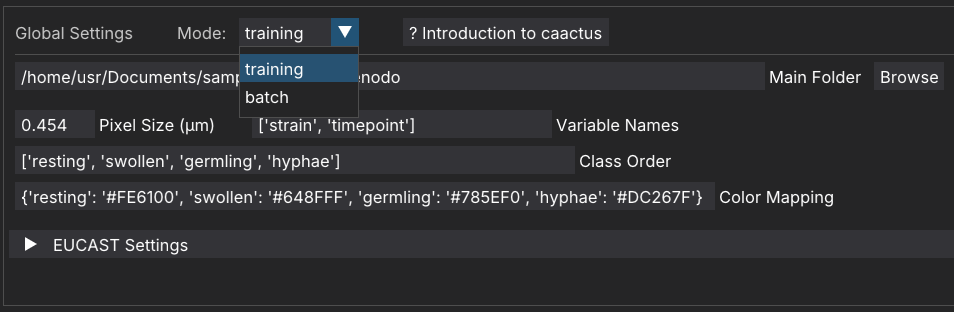


### 7.3 Pre-Processing - Renaming
1. In your main folder (`sampledata_CD6_zenodo`), inspect the `renaming.csv` spreadsheet to see how it is constructed.
2. In the GUI, go to `Pre-Processing **1. Renaming** and click **Run**.
3. If you click on the dropdown menu `Advanced paths`, a menu will open that will allow you to change the input and output folders, as well as the name of the renaming file. 

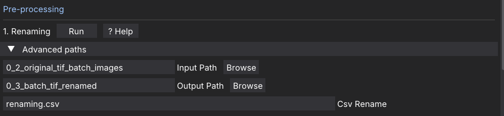

### 7.4 Pre-Processing - Tif to h5
1. In the GUI, go to `Pre-Processing **2. Tif to h5** and click **Run**.
3. If you click on the dropdown menu `Advanced paths`, a menu will open that will allow you to change the input and output folders.

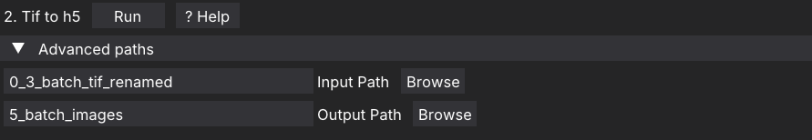

## 7.4 Batch Pixel Classification
In the caactus GUI, find **3. Pixel Classification**, click **? Help** for the full instructions. Summary:

1. Open ilastik.

2. Open the pre-trained pixel classification project from the sample data (`1_pixel_classification.ilp`).
> [!CAUTION]
> DO NOT CHANGE anything in `1. Input Data`, `2. Feature Selection`, or `3. Training` when running Batch Processing!

3. Under `4. Prediction Export`:
   - Select **Probabilities** from the dropdown.
   - Click **Choose Export Image Settings** and set the output path at `File`:
  ```bash
  {dataset_dir}/../6_batch_probabilities/{nickname}_{result_type}.h5
  ```


4. Click `OK`

5. Go to `5. Batch processing` tab

6. Under `Raw data`, add the .h5 files from `5_batch_images` folder.                                                                  
                                                                                    
7. Now click `Process all files`.

8. The output will be saved as _Probabilities.h5 files in the output folder.


## 7.5 Batch Processing Multicut Segmentation
In the caactus GUI, find **4. Boundary Segmentation**, click **? Help** for the full instructions. Summary:

1. In ilastik, open the pre-trained Boundary Segmentation project (`2_boundary_segmentation.ilp`).
> [!CAUTION]
> DO NOT CHANGE anything in `1. Input Data`, `2. DT Watershed`, or `3. Training and Multicut` when running Batch Processing!

> [!NOTE]
> The `*_Multicut Segmentation.h5` files are generated here — they do not exist beforehand.

2. Under `4. Data Export`, click **Choose Export Image Settings** and set the output path at `File`:
  ```bash
  {dataset_dir}/../7_batch_multicut/{nickname}_{result_type}.h5
  ```

4. Click `OK`

5. Go to `5. Batch processing`.

6. Under,`Raw data`, add the .h5 files from `5_batch_images` folder.

7. Under `Probabilities`, add the data_Probabilities.h5 files from `6_batch_probabilities` folder.


8. Go to `5. Batch Processing` and click `Process all files`.

9. The output will be saved as `*_Multicut Segmentation.h5` files in the output folder (`7_batch_multicut`).

10. Close the `2_boundary_segmentation.ilp`project-file in ilastik.


## 7.6 Batch Background Processing
1. Switch back to the caactus GUI.
2. Find **5. Background Processing**. 
3. Click **Run**. The background is now removed and you can continue with object classification in ilastik.


## 7.7 Batch Object Classification
In the caactus GUI, find **6. Object Classification**, and click **? Help** for the full instructions. Summary:

1. Switch back to ilastik.

2. Open your trained object classification project (`3_object_classification.ilp`).
> [!CAUTION]
> DO NOT CHANGE anything in `1. Input Data`, `2. Object Feature Selection`, or `3. Object Classification` when running Batch Processing!

3. Under `4. Object Information Export`:
   - Select **Object Predictions** from the dropdown.
   - Click **Choose Export Image Settings** and set the output path at `File`:
  ```bash
  {dataset_dir}/../8_batch_objectclassification/{nickname}_{result_type}.h5
  ```


4. Under "4. Object Information Export", choose "Configure Feature Table Export" with the following settings:

                                                                        
5. In `Configure Feature Table Export General` choose format `.csv` and change output directory to:
  ```bash
  {dataset_dir}/../8_batch_objectclassification/{nickname}.csv
  ```

Choose  `Features` to choose the Feature you are interested in exporting.


6. Click `OK`

7. Go to 5. `Batch Processing` tab

8. Under  `Raw data`, add the .h5 files from `5_batch_images` folder.

9. Under `Segmentation Image`, add the data_Multicut Segmentation.h5 files from `7_batch_multicut` folder.

10. Go to `5. Batch Processing` and click `Process all files`.                                                                                                                               
11.  The output will be saved as `*_Object Predictions.h5` files and `*_table.csv` in the output folder (`8_batch_objectclassification`).

12. Now you have performed all steps in ilastik. You can close ilastik.

## 7.8 CSV Summary
1. Switch back to the caactus GUI.
2. The default Pixel Size is already set in Global Settings — you can leave it as-is for the sample data.
3. Find **7. CSV Summary** and click **Run**.
4. Inspect the generated `df_clean.csv`. This spreadsheet combines all feature tables from Object Classification into one file for downstream analysis.

## 7.9 Summary Statistics
2. Find **8. Summary Statistics** and click **Run**.
4. Inspect the generated results. The output generated will be 
    - a) `df_summary_complete.csv` = .csv-table containing also **not usable** category,
    - b) `df_refined_complete.csv` = .csv-table without **not usable** category", 
    - c) `counts.csv` dataframe used in PlnModelling
    - d) bar graph (`barchart.png`) (faceted by condition1 on x-axis, percent of morphotypes "Predicted Class" on the y-axis and condition2 as the facetting variable in rows.) You can play around by putting `'condition2'` first and `'condition1'` second to see how it changes the plot.
5. You may also change the colors:
 change the default 
```bash 
{'resting': '#FE6100', 'swollen': '#648FFF', 'germling': '#785EF0', 'hyphae': '#DC267F'}
```
 to
```bash 
{'resting': 'yellow', 'swollen': 'cyan', 'germling': 'blue', 'hyphae': 'magenta'}
```

6. Similarly, you my change the morphotype names. Open `df_clean.csv` in a speadsheet software (e.g. Excel). Replace all `resting`with `dormant` (use `Ctrl+F` - `Replace all`, save `df_clean.csv`). Now re-do step `7.9 Summary Statistics`. Before you click `Run`, make sure you replace `resting` with `dormant`in both `Class order`
```bash 
['resting', 'swollen', 'germling', 'hyphae']
```

and `Color Mapping` fields.

```bash 
{'dormant': 'yellow', 'swollen': 'cyan', 'germling': 'blue', 'hyphae': 'magenta'}
```


7. Let's imagine you only have 3 cell categories in your dataset.
Again, open `df_clean.csv` in a speadsheet software (e.g. Excel). Replace all `dormant`with `spores` (use `Ctrl+F` - `Replace all`, save `df_clean.csv`).

 Similarly, replace all `swollen`with `spores` (use `Ctrl+F` - `Replace all`, save `df_clean.csv`).
Now change the `Class Order`field to
```bash 
['spores', 'germling', 'hyphae']
```
and the `Color Mapping`field to 

```bash 
{'spores': 'yellow', 'germling': 'blue', 'hyphae': 'magenta'}
```


## 7.10 PLN Modelling
1. Find **10. PLN Modelling** and click **Run**.
2. Inspect the generated results in the subdirecory `/sampledata_CD6_zenodo/9_data_analysis/` The output generated will be 
    - a) `correlation_circle.png`. Shows that PCA1, accounting for ~57% of the variance, primarily separated samples by condition2, whereas  PCA2 accounted for ~25% of the variance based on condition1.
    - b) `pca_plot.png`. The PCA plot shows how the images are grouped together in 2D-space based on combined category of condition1 and condition2 (the categorical levels will be combined).